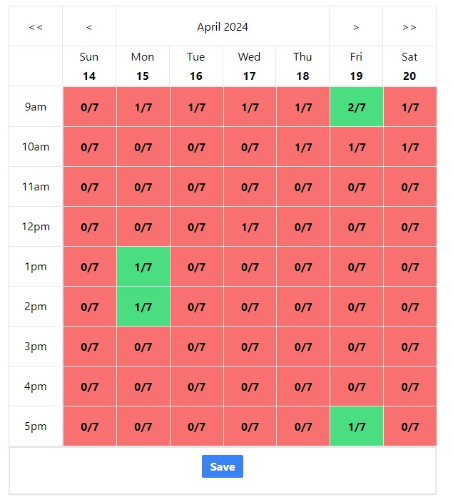

# Meeting Time Finder
- A web application designed to simplify the process of scheduling meetings and managing available time slots. It allows users to create rooms, invite participants, and select available time slots for meetings.

# Features
### Room Creation
- Users can create rooms for specific meetings or events.
- Each room has a unique code and can accommodate multiple participants.
### Participant Management
- Users can invite participants to join a room by providing their room IDs.
- Participants can view and manage their available time slots for the selected room.
- Participants can view how many other participants are available at a given time slot.
### Technologies Used
- Frontend: The frontend of the application is built using React.js and tailwindcss, providing a responsive and interactive user interface.
- Backend: The backend is developed using ASP.NET Core, providing robust APIs for managing rooms, participants, and time slots.
- Database: The application uses a relational database (e.g., SQL Server) to store room and participant data.
  
### Getting Started
To run meeting-time-finder application locally, follow these steps:

* Clone the repository to your local machine.
* Navigate to the project directory.
* Install dependencies for both the frontend and backend.
* Configure the database connection string in the backend.
* Start the backend server (start in visual studio).
* Start the frontend server using npm run dev.
* Access the application in your web browser.

### Future Scope
- Add functionality to update start/end and interval times.
- Add interface to allow particiapnts to see who is available at a given time.
